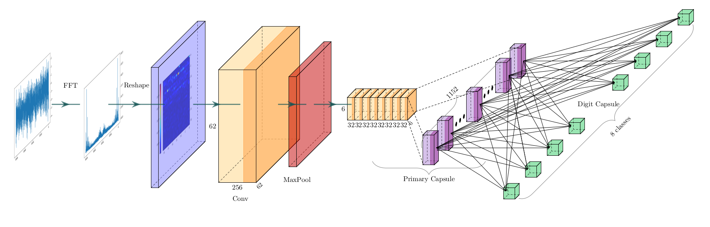
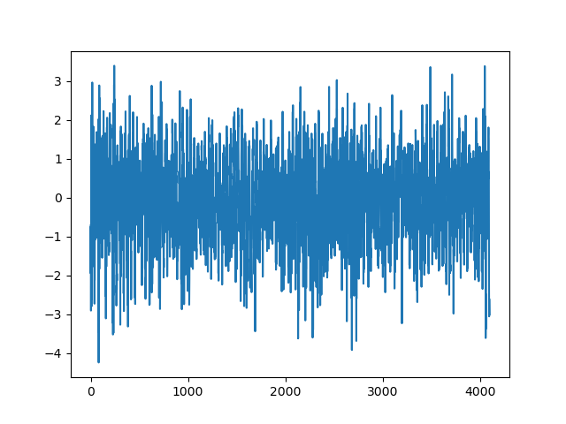
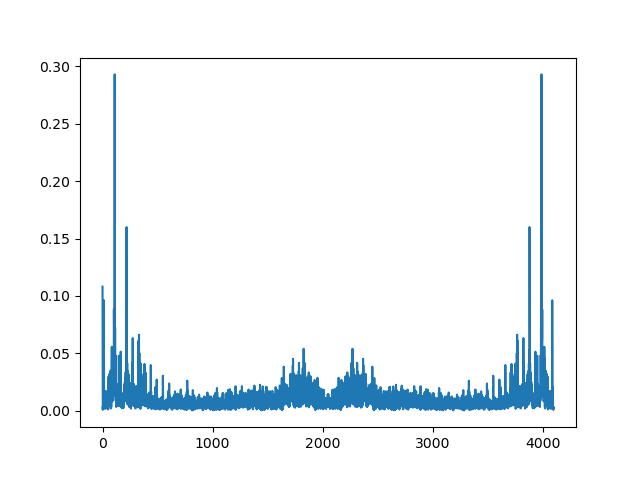
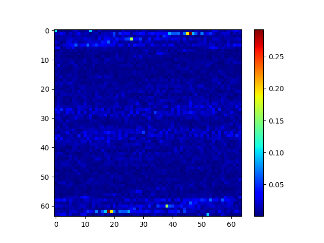
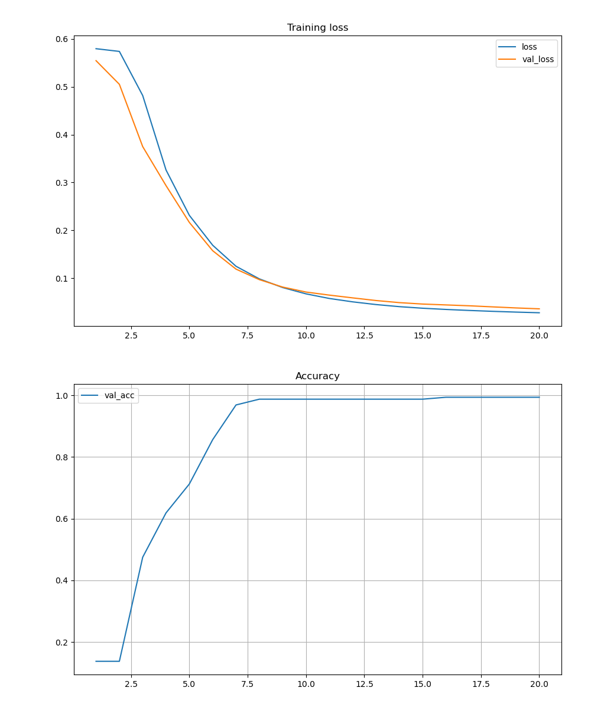

# CuteBird

这是一个用于机械故障检测的项目。之所以叫可爱小鸟的原因，可能是因为鸟类的视力特别好，可以发现小虫子。再者说，他们也很可爱。在当前版本，我们在实验室测试了一些行星齿轮箱的振动数据，总共有8个错误类型。并使用胶囊神经网络用于模式识别，在振动中检测错误类型，其表现非常不错。
## 具体方法
1. 我们在实验中获得了一些振动数据



2. 并且我们有足够的理由相信机械内部结构损坏可以表现在振动频率上。而利用离散傅里叶变换或者短时傅里叶变换就可以得到信号的频率信息



3. 明显，我们可以将一个一维数据变为一张图，输入至神经网络中



4. 明显，Hiton提出的胶囊神经网络具有良好的表现性能。因此我们选择使用该架构处理数据

### 系统整体架构图


## 性能表现
其训练过程中正确率与损失变化曲线如下



## 未来展望
如何在高噪声环境下依然具有较高的故障检测正确率，这是一个问题。使用小波变换可能会是一种方法

## 使用说明
```
python main.py
```

## 引用

参考论文：https://arxiv.org/abs/1710.09829

程序参考代码： https://github.com/XifengGuo/CapsNet-Pytorch

