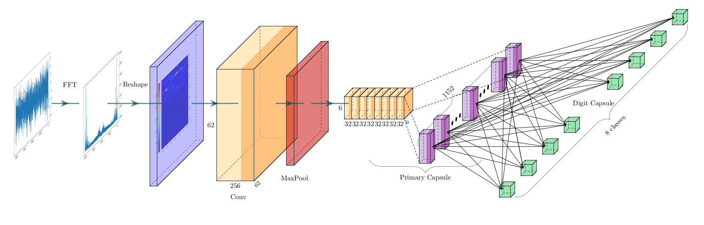
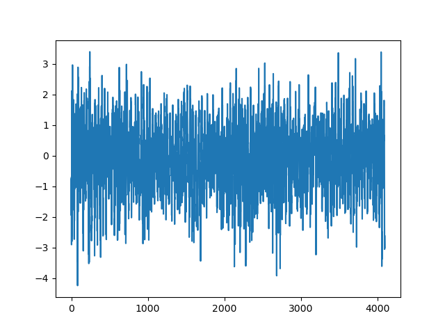
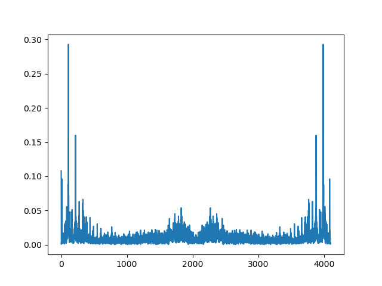
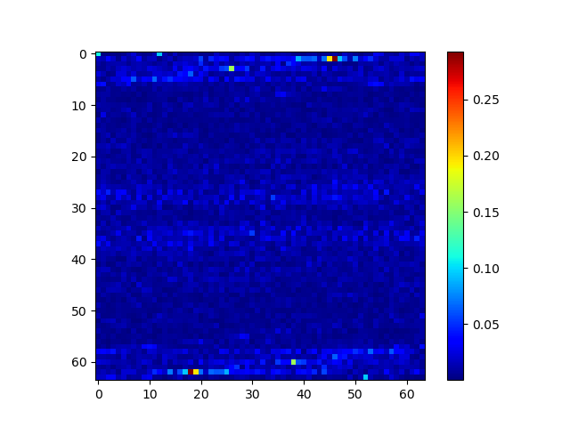
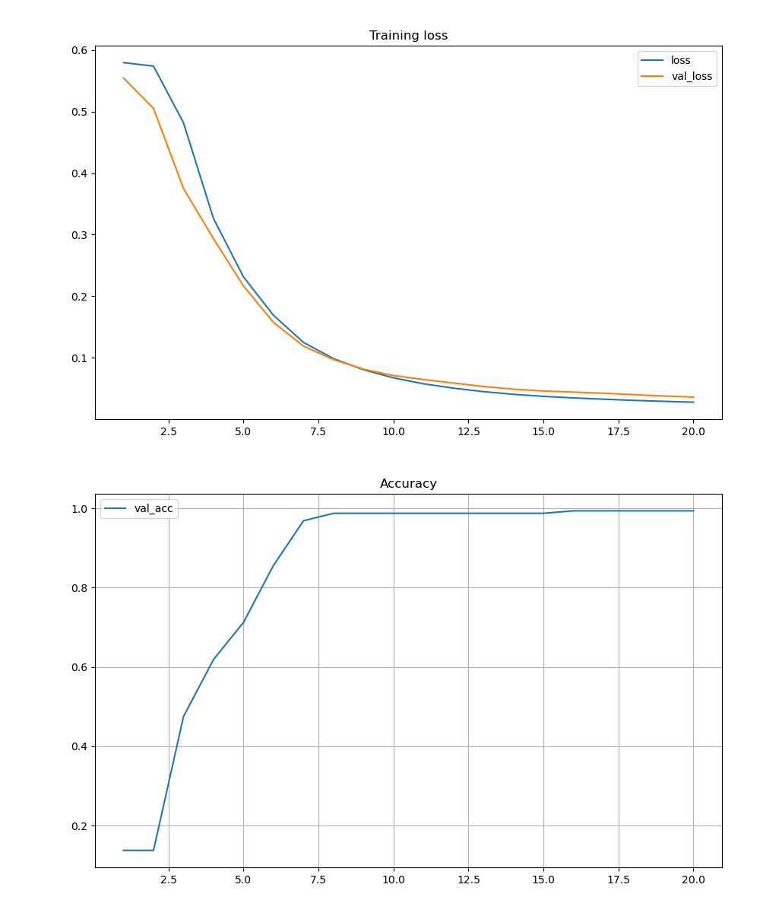

# CuteBird
[中文](./README-ZH.md)

This is a project for mechanical failure detection. The reason why it is called cute little bird may be because the eyesight of birds is particularly good, and they can detect small bugs. Besides, they are cute too. In the current version, we have tested some planetary gearbox vibration data in the lab, and there are 8 error types in total. And use Capsule Neural Networks for pattern recognition to detect error types in vibrations and it works really well.

## Methods
1. We get some vibration data in the lab



2. And we have enough reasons to believe that the damage of the internal structure of the machine can be manifested in the vibration frequency. The frequency information of the signal can be obtained by using discrete Fourier transform or short-time Fourier transform.



3. Obviously, we can turn a one-dimensional data into a graph and input it into the neural network



4. Obviously, the capsule neural network proposed by Hiton has good performance. So we choose to use this schema to process the data

### Architecture


## Perform
The curve of accuracy and loss in the training process is as follows


## Future
How to still have a high fault detection accuracy in a high-noise environment is a problem. Using wavelet transform might be a way.

## How to use?
```
python main.py
```
## Reference

Reference papers：https://arxiv.org/abs/1710.09829

Reference code： https://github.com/XifengGuo/CapsNet-Pytorch

